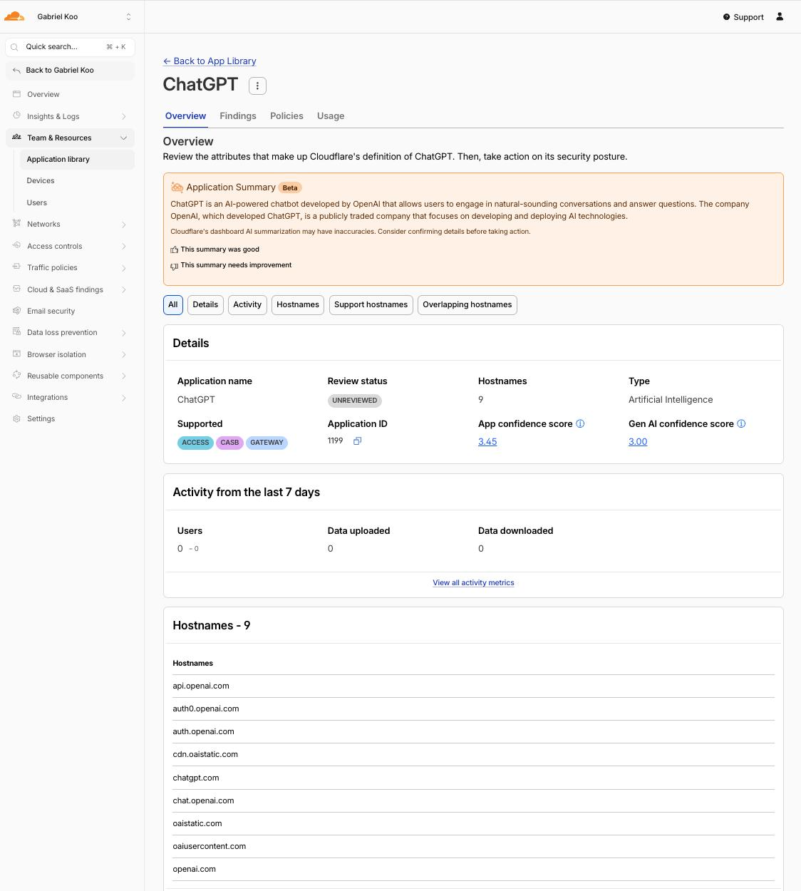

# tailscale-config-for-ai-services
About Using ChatGPT/Gemini with Tailscale with an app connector, from an unrestricted region.

## Setup

- Copy my config file into `https://login.tailscale.com/admin/acls/file`
- Create a virtual machine as an `App Connector` (https://tailscale.com/kb/1281/app-connectors) ~, that isn't blocked by the AI providers~
- Follow the setup setups to add the VM into Tailscale (https://login.tailscale.com/admin/machines/new-linux)
- Confirm the app connectors are working via `https://login.tailscale.com/admin/apps`.

## Why Bother Use This But Not An Always On VPN?
You may have wondered - I could have just used a normal exit node config with tailscale!

If you are turning on a always-on VPN just for the sake of securely connecting to AI resources via an unrestricted region, it might slow down your entire web browsing experience as a whole, also it might affect your access to security-aware services like e-banking or your company resources, which are sensitive to VPN IP addresses. If you are using a split tunnel instead, you are only routing the traffic to the VPN only when it connects to the AI service - this essentially reduces the traffic load on your VPN server, and minimizes the interruption to your other normal browsing activities.

## What Works?

- [x] Google:
  - [x] Google AI Studio (aistudio.google.com)
    - [x] Google AI Studio's stream realtime (Web Version)
    - [x] Google Gemini API (generativelanguage.googleapis.com)
    - [x] Vertex AI / AI Platform (*.aiplatform.googleapis.com)
  - [x] Google Gemini web app (gemini.google.com) — Google has lifted the Hong Kong block, so HK users no longer need this; kept for other geo-restricted regions
  - [x] NotebookLM (notebooklm.google.com)
  - [x] Google Antigravity (antigravity.google, the agentic IDE)
- [x] OpenAI
  - [x] ChatGPT Web (chatgpt.com and mobile app version on iOS)
  - [x] Sora.com
  - [x] OpenAI documentation (platform.openai.com)
- [x] Anthropic / Claude (claude.ai web + api.anthropic.com) (Thanks [@alexlau811](http://github.com/alexlau811/))
- [x] Groq (groq.com)
- [x] Kiro
- [x] Amazon Bedrock
- [ ] Apple Intelligence, (Ref: https://github.com/tailscale/tailscale/issues/13963)
  - [ ] on macOS
  - [ ] on iOS

## How Do I Come Up With the List of Domains?

There's no single magic list. I build each app connector's domain set from a few sources, then **prune aggressively** based on how the app actually works.

### Sources I start from

- **Cloudflare's Application Library.** Cloudflare maintains a catalog of well-known SaaS apps with the hostnames they've observed. It's a great starting point. For example, here's the ChatGPT entry (App ID `1199`) listing 9 hostnames:

  

  > You can find these under **Zero Trust → Team & Resources → Application library** in the Cloudflare dashboard, or browse the public catalog.

- **Vendor firewall/allowlist docs.** Many vendors publish the exact domains their desktop/CLI client needs (e.g. [Kiro's firewall doc](https://kiro.dev/docs/privacy-and-security/firewalls/)). These are the most reliable.
- **My own observation.** Open the app's DevTools → Network tab (or watch the app connector's traffic logs in Tailscale), use the feature you care about, and note which hostnames it hits that are *geo-blocked or fail*.

### The hard part: excluding domains that are "too generic"

You can't just dump every hostname the app touches into the connector. **You have to understand how the app works** so you only proxy what genuinely needs the unrestricted region — and exclude domains that are too generic.

A domain is "too generic" when routing it through the app connector would scoop up large amounts of *unrelated* traffic, which defeats the whole point of a split tunnel (and can overload the connector or break other services). Watch out for:

- **Shared cloud/CDN endpoints** — `*.cloudflare.net`, `*.amazonaws.com`, `*.akamaiedge.net`, `*.googleapis.com`. These back thousands of unrelated services. Proxying the bare wildcard would route far more than your AI app. Scope them down to the *specific* sub-hostnames the app uses (e.g. `e3913.cd.akamaiedge.net` for Claude, not `*.akamaiedge.net`).
- **Generic auth/identity endpoints** — `accounts.google.com`, `oauth2.googleapis.com`. Sometimes unavoidable (Antigravity's sign-in needs them), but be aware you're now routing *all* Google sign-in through the exit node. Only include them when the app's auth flow actually breaks without it.
- **Telemetry/analytics that don't gate access** — Sentry, Sift, analytics pixels. Usually safe to *omit*; the app still works. I only add them (e.g. `*.siftscience.com`, `o1158394.ingest.us.sentry.io` for Claude) when their absence triggers a fraud/region check that blocks login.

### Rule of thumb

> Include the **narrowest** set of hostnames that makes the geo-restricted feature work — and nothing broader. If a wildcard would match traffic from other apps, pin it to the exact sub-hostname instead. When in doubt, leave it out and add it back only if something actually breaks.

## On the App Connector Virtual Machine

If you are picking AWS, be sure to use Lightsail instead of an EC2 instance!

​When configuring a virtual machine (VM) for VPN purposes, AWS Lightsail offers a compelling advantage over EC2 due to its predictable pricing and generous data transfer allowances. For instance, the $3.50 per month Linux/Unix plan includes 1 TB of data transfer, encompassing both inbound and outbound traffic, which is particularly beneficial for VPN applications that typically involve substantial data movement. In contrast, AWS EC2 charges separately for data transfer, with outbound data transfer to the internet costing $0.09 per GB beyond the free tier, which only includes the first GB free. This means that with EC2, transferring 1 TB of data out could result in significant additional costs, making Lightsail a more cost-effective and straightforward choice for setting up a VPN server.
